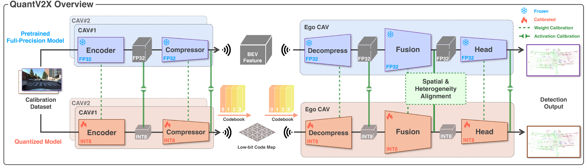

# QuantV2X: A Fully Quantized Multi-Agent System for Cooperative Perception
[](https://quantv2x.github.io/QuantV2X/)
[](http://arxiv.org/abs/2509.03704)

[Seth Z. Zhao*](https://sethzhao506.github.io/), [Huizhi Zhang*](https://zhang-huizhi.github.io/), [Zhaowei Li](https://www.linkedin.com/in/zhaowei-li-892480/), [Juntong Peng](https://juntongpeng.github.io/), [Anthony Chui](https://www.linkedin.com/in/anthony-chui-499b31274/), [Zewei Zhou](https://zewei-zhou.github.io/), [Zonglin Meng](https://scholar.google.com/citations?user=rlKJHMcAAAAJ&hl=zh-CN), [Hao Xiang](https://scholar.google.com/citations?user=04j4RzkAAAAJ&hl=en), [Zhiyu Huang](https://mczhi.github.io/), [Fujia Wang](https://www.linkedin.com/in/fujiawang/), [Ran Tian](https://thomasrantian.github.io/), [Chenfeng Xu](https://www.chenfengx.com/), [Bolei Zhou](https://boleizhou.github.io/), [Jiaqi Ma](https://mobility-lab.seas.ucla.edu/about/)



This is the official implementation of "QuantV2X: A Fully Quantized Multi-Agent System for Cooperative Perception". In this work, we address the problems of inefficiency and performance degradation for cooperative perception in real-world resource-constrained scenarios. We illustrate the system-level latency bottleneck in full-precision systems and introduce QuantV2X, a fully quantized multi-agent system for cooperative perception that enables efficient model inference and multi-agent communication with maximum perception performance preservation while meeting the requirements of real-world deployment. To the best of our knowledge, this is the first work to demonstrate the viability and practicality of a fully quantized intermediate fusion system for future real-world deployment.

This work is part of our broader vision of building an __efficient and scalable V2X ecosystem__, comprising data-efficient pretraining with [CooPre](https://arxiv.org/pdf/2408.11241), training-efficient multi-agent learning with [TurboTrain](https://arxiv.org/pdf/2508.04682), and inference-efficient cooperative perception with [QuantV2X](http://arxiv.org/abs/2509.03704).

## ICCV 2025 DriveX Tutorials
- [Notebook Tutorial](docs/notebook/QuantV2X_DriveX_Tutorial.ipynb)

## News
- **`2025/10`**: This codebase will be featured as the main tutorial repository for [ICCV 2025 Tutorial: Beyond Self-Driving: Exploring Three Levels of Driving Automation](https://drivex-tutorial.github.io/).
- **`2025/09`**: QuantV2X is selected as **Oral Presentation** in [ICCV 2025 X-Sense Workshop](https://x-sense-ego-exo.github.io/index.html).
- **`2025/09`**: [QuantV2X](http://arxiv.org/abs/2509.03704) paper release and initial codebase release.

## ✅ Currently Supported Features
- [√] Full-Precision Baseline Training and Inference on V2X-Real Dataset, covering the original functionality of [V2X-Real](https://github.com/ucla-mobility/V2X-Real) codebase.
- [√] Codebook Learning Training and Inference Pipeline.
- [√] Post-Training Quantization (PTQ) Pipeline.
- [√] Support on OPV2V(-H) and DAIR-V2X datasets.
- [√] TensorRT Deployment Pipeline.

## V2X-Real Data Download

For V2X-Real dataset, please check [website](https://mobility-lab.seas.ucla.edu/v2x-real/) to download the data. The data is in OPV2V format. 

After downloading the data, please put the data in the following structure:
```shell
├── v2xreal
│   ├── train
|      |── 2023-03-17-15-53-02_1_0
│   ├── validate
│   ├── test
```

## Other Data Preparation
- OPV2V: Please refer to [this repo](https://github.com/DerrickXuNu/OpenCOOD). You also need to download `additional-001.zip` which stores data for camera modality.
- OPV2V-H: Please refer to [Huggingface Hub](https://huggingface.co/datasets/yifanlu/OPV2V-H) and refer to [Downloading datasets](https://huggingface.co/docs/hub/datasets-downloading) tutorial for the usage.
- DAIR-V2X-C: Download the data from [this page](https://thudair.baai.ac.cn/index). We use complemented annotation, so please also follow the instruction of [this page](https://siheng-chen.github.io/dataset/dair-v2x-c-complemented/). 

It is recommended that you download **V2X-Real** and try them first. Please refer to the original github issues if you have trouble downloading **OPV2V** and **DAIR-V2X-C**.

## Installation

### Step 1: Basic Installation

```bash
conda create -n quantv2x python=3.8 pytorch==1.12.0 torchvision==0.13.0 torchaudio==0.12.0 cudatoolkit=11.6 -c pytorch -c conda-forge
conda activate quantv2x
# install dependency
pip install -r requirements.txt
# install this project. It's OK if EasyInstallDeprecationWarning shows up.
python setup.py develop
```

### Step 2: Install Spconv 2.x

To install **spconv 2.x**, check the [table](https://github.com/traveller59/spconv#spconv-spatially-sparse-convolution-library) to run the installation command. For example we have cudatoolkit 11.6, then we should run

```bash
pip install spconv-cu116 # match your cudatoolkit version
```

### Step 3: Bbx IoU cuda version compile

Install bbx nms calculation cuda version

```bash
python opencood/utils/setup.py build_ext --inplace
```

### Support for newer GPU Architecture (sm_100+)
Please refer to [this issue](https://github.com/ucla-mobility/QuantV2X/issues/15#issue-3926686565) regarding the support for GPU Architecture (sm_100+). We thank [erikleohasstum](https://github.com/erikleohasstum) for this contribution.

## Tutorials
- [Tutorial of Baseline Training and Inference on V2X-Real dataset](docs/Tutorial_V2X-Real_Baseline.md)
- [Tutorial of Codebook Learning on V2X-Real dataset](docs/Tutorial_V2X-Real_Codebook.md)
- [Tutorial of PTQ on V2X-Real dataset](docs/Tutorial_V2X-Real_PTQ.md)
- [Tutorial of Training and Inference on other datasets](docs/Tutorial_Other_Datasets.md)
- [Tutorial of TensorRT Export](docs/Tutorial_Tensorrt_Export.md)

We welcome the integration of other datasets from the community. Please submit a pull request for potential codebase integration.

## Acknowledgement
The codebase is built upon [HEAL](https://github.com/yifanlu0227/HEAL) and [V2X-Real](https://github.com/ucla-mobility/V2X-Real).

## Citation
If you find this repository useful for your research, please consider giving us a star 🌟 and citing our paper.
 ```bibtex
@article{zhao2025quantv2x,
  title={QuantV2X: A Fully Quantized Multi-Agent System for Cooperative Perception},
  author={Zhao, Seth Z and Zhang, Huizhi and Li, Zhaowei and Peng, Juntong and Chui, Anthony and Zhou, Zewei and Meng, Zonglin and Xiang, Hao and Huang, Zhiyu and Wang, Fujia and others},
  journal={arXiv preprint arXiv:2509.03704},
  year={2025}
}
```

Other useful citations:
 ```bibtex
@article{zhao2024coopre,
  title={CooPre: Cooperative Pretraining for V2X Cooperative Perception},
  author={Zhao, Seth Z and Xiang, Hao and Xu, Chenfeng and Xia, Xin and Zhou, Bolei and Ma, Jiaqi},
  journal={arXiv preprint arXiv:2408.11241},
  year={2024}
}

@article{zhou2025turbotrain,
  title={TurboTrain: Towards Efficient and Balanced Multi-Task Learning for Multi-Agent Perception and Prediction},
  author={Zhou, Zewei and Zhao, Seth Z. and Cai, Tianhui and Huang, Zhiyu and Zhou, Bolei and Ma, Jiaqi},
  journal={arXiv preprint arXiv:2508.04682},
  year={2025}
}

@article{zhou2024v2xpnp,
 title={V2XPnP: Vehicle-to-Everything Spatio-Temporal Fusion for Multi-Agent Perception and Prediction},
 author={Zhou, Zewei and Xiang, Hao and Zheng, Zhaoliang and Zhao, Seth Z. and Lei, Mingyue and Zhang, Yun and Cai, Tianhui and Liu, Xinyi and Liu, Johnson and Bajji, Maheswari and Xia, Xin and Huang, Zhiyu and Zhou, Bolei and Ma, Jiaqi},
 journal={arXiv preprint arXiv:2412.01812},
 year={2024}
}

@article{xiang2024v2xreal,
  title={V2X-Real: a Largs-Scale Dataset for Vehicle-to-Everything Cooperative Perception},
  author={Xiang, Hao and Zheng, Zhaoliang and Xia, Xin and Xu, Runsheng and Gao, Letian and Zhou, Zewei and Han, Xu and Ji, Xinkai and Li, Mingxi and Meng, Zonglin and others},
  journal={arXiv preprint arXiv:2403.16034},
  year={2024}
}
```

## Other Development Team Members
[Aiden Wong](https://www.linkedin.com/in/aidwong)
